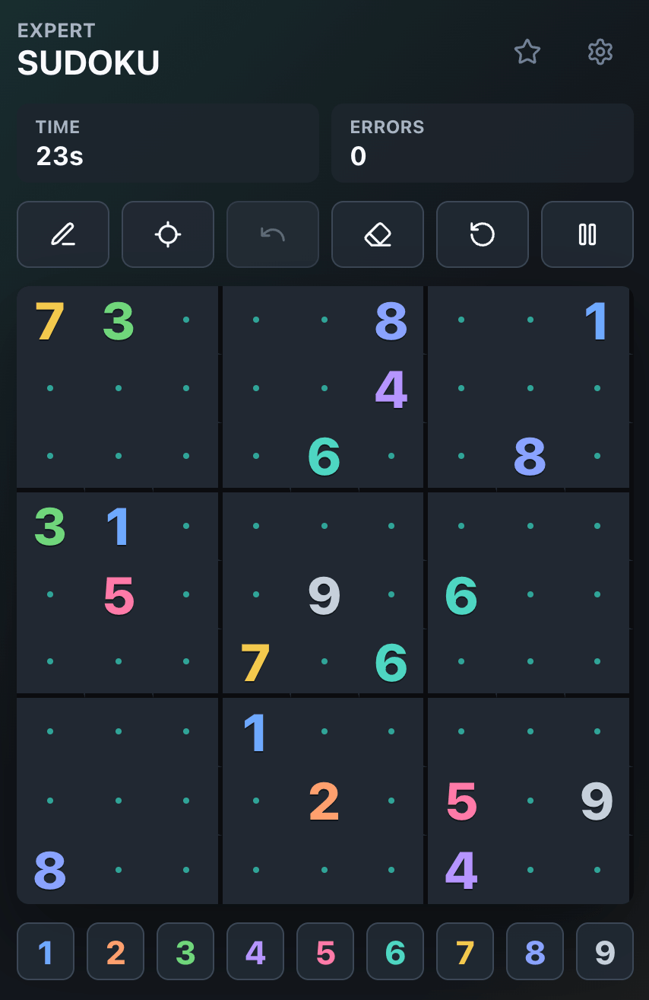
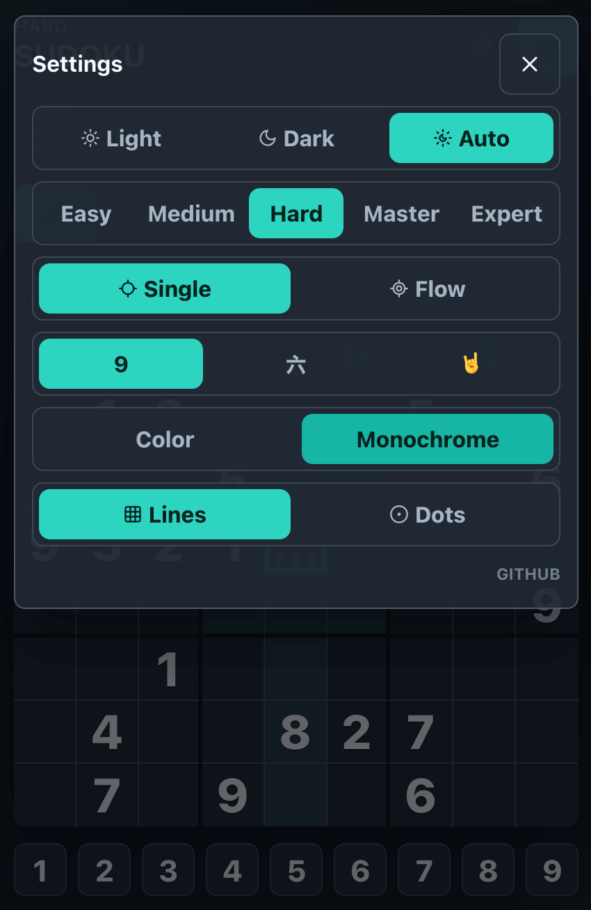
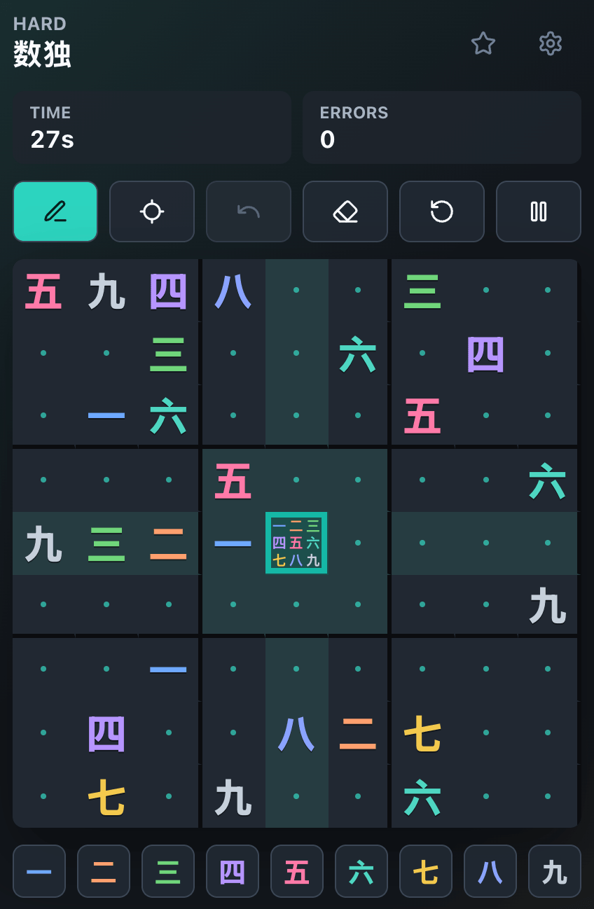

# Sudoku

A client-only Sudoku game built for quick, focused play in the browser.

## Play

Visit and play here: https://mgiberts.github.io/sudoku/

| | | |
|---|---|---|
|  |  |  |

## Documentation

- [Architecture](docs/ARCHITECTURE.md)

## Stack

- React
- TypeScript
- Biome
- Vite

## Roadmap

### 1. Become an offline page

- Add a web app manifest with app name, theme color, and icons.
- Add a small service worker that caches the built HTML, CSS, JavaScript, and static assets.
- Show a stable fallback experience when the user opens the page without network access.
- Test installability and offline loading in Chrome DevTools.

### 2. Game history and seed sharing

- Add a history panel that shows the player's most recent games.
- Let players replay a game from their history.
- Let players share a game seed with others so they can compete for the best time.

## License

This project is licensed under the PolyForm Noncommercial License 1.0.0. You may use, copy, modify, and distribute the code for noncommercial purposes only. See [LICENSE](LICENSE) for details.
